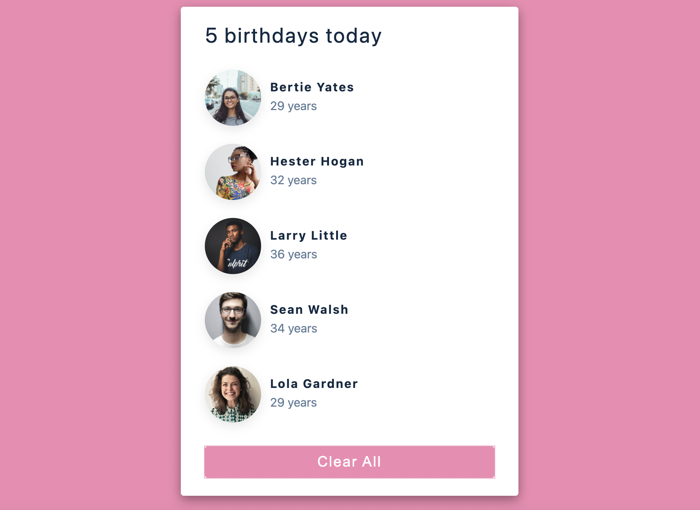
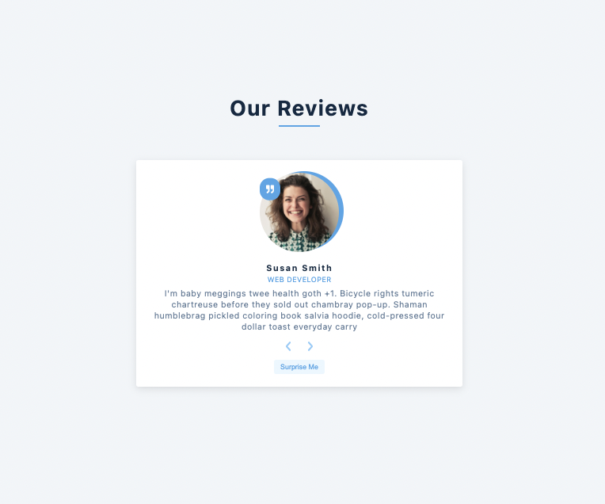

## Small React projects made with John Smilga's React tutorial

## Corresponding Tutorial Topics

#### useState

1. Birthday Reminder

- it is a list of birthdays, each person has an image, name and age
- clear all button
- idea: https://www.uidesigndaily.com/posts/sketch-birthdays-list-card-widget-day-1042

  

#### useEffect and Conditional Rendering

2. Tours

- fetch list of tours, loading option
- for every tour there is a image, name, price, read more/show less button
- remove functionality
  

3. Reviews

- functionality that allows us to show different reviews; forwards, backwards and random
- using react icons library; npm install react-icons --save
  

4. Accordion

- there is a list of questions and toggle functionality for the answers
- during toggling we change the icon inside of the button
- idea: https://uidesigndaily.com/posts/sketch-accordion-website-day-1175
- react-icons: npm install react-icons --save

5. Menu

- list of menu items
- dynamically added buttons (the more types you have in the list, the more buttons you'll have). Buttons allow us to filter the list (all, breakfast, lunch, shakes)

6. Tabs

- tabs which display detailed information
- fetch from external Api with built in fetch function

7. Slider

- prev/next button
- auto slide option with setInterval
- in action: https://gatsby-airtable-design-project.netlify.app/

#### Forms

8. Lorem Ipsum Generator

- 'dummy text' generator
- user can determine the number of paragraphs and click button 'generate'. Max paragraph number is 8.
- inspiration: Hipster ipsum https://hipsum.co

9. Color Shades Generator

- user passes in a color, the app returns different tints and shades of the particular color
- by pushing on a certain tint/shade, we copy its value to the clipboard
- error functionality; if the input color doesn't exist
- using data from external library [values.js](https://github.com/noeldelgado/values.js)

10. Grocery Bud

- it is a form, we can add, delete or edit items in the list
- alert functionality, toggling between success and danger, showing alert for 3 sec (setTimeout)
- use of one of the browser Api: the local storage

#### useRef

11. Navbar

- building a navbar, toggling the links position on big and small window, smooth toggling via className/css
- navbar height changes dynamically according to the number of links inside
- using useRef hook

#### useContext

12. Modal And Sidebar

- toggle functionality between modal and sidebar
- add context to the whole app; useContext and context Api
- as an alternative: in order to reduce the imports, we can create a custom hook, that provides access to the AppContext

13. Menus and Submenus

- inspiration: https://stripe.com
- navbar and sidebar (menus/submenus) for large and small screen
- submenus position and width change dynamically

#### useReducer and useContext

14. Cart

- fetching data from external Api, using useReducer
- ability to increase/decrease the amount of the items in the cart
- remove item functionality, clear cart

#### React Router and useCallback

15. Cocktails

- external Api: https://www.thecocktaildb.com
- React Router Dom; multiple pages (home, about, single product page)
- search form with uncontrolled input(useRef). When the user begins to type, we refetch the data.
- React Router Fix form Netlify deployment

(Fix)[https://dev.to/dance2die/page-not-found-on-netlify-with-react-router-58mc]
"build": "CI= react-scripts build",

### Advanced Projects (API and External Libraries)

16. Markdown-preview

- on the left side user can write the markdown and the result appears on the right side. The result is html that we can style with css the way we want.
- using the react marktdown library: https://www.npmjs.com/package/react-markdown
- text aria with controlled input

17. Random-person

- external Api: https://randomuser.me. API for generating random user data. Like Lorem Ipsum, but for people.
- display a random user and specific info about the user (name, address, e-mail etc.)

18. Pagination

- fetching 100 github followers and displaying the result on 10 pages. This is an example for pagination on the front-end. Array of arrays.
- next/prev buttons, show the active page button
- custom hook: useFetch

19. Stock photos

- gitting images from unsplash Api: https://unsplash.com/documentation;
- working with an access key  
  Cra env vars: https://create-react-app.dev/docs/adding-custom-environment-variables/
  1. create .env file in the root (side by side with package.json)
  2. in the .env file: REACT_APP_ACCESS_KEY=
  3. use it in useFetch or wherever is needed like this:  
     {process.env.REACT_APP_ACCESS_KEY}
  4. add .env file to gitignore
  5. restart the dev server (ctr C and npm start)
- infinite scroll, input search form, link to the photo creater

20. Dark mode (and working with date)

- landing page for a blog that has a toggle button for the page layout. It switches between dark and white mode.
- working with moment js (https://momentjs.com), library for date formatting
- saving dark/white mode setting for particular user, working with locale storage
- inspiration: https://overreacted.io

21. MoviesDB

- search form for movies using external Api: http://www.omdbapi.com
- in case of no match, an error is displayed (error message from the Api)
- single movie page with details about it
- Context Api, React Router Dom, access key: env veriable

22. Hacker news

- it is a news blog with a search form
- fetch articles from external Api (https://hn.algolia.com/api) that reference the input
- remove and show more buttons
- server side pagination. Prev/next button, when we click them, we fetch a new page from the server.
- useReducer and Context Api

23. Setup Quiz

- setup quiz form where user can set the number of questions, category and difficulty and generate a quiz
- Api: https://opentdb.com
- library: axios, npm install axios; Axios is designed to handle http requests and responses.
  It's used more often than Fetch because it has a larger set of features and it supports older browsers.
- control input setup form
